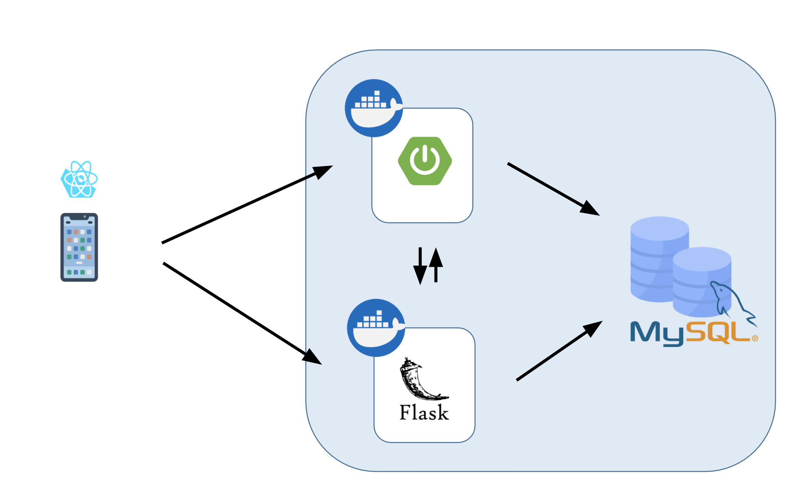
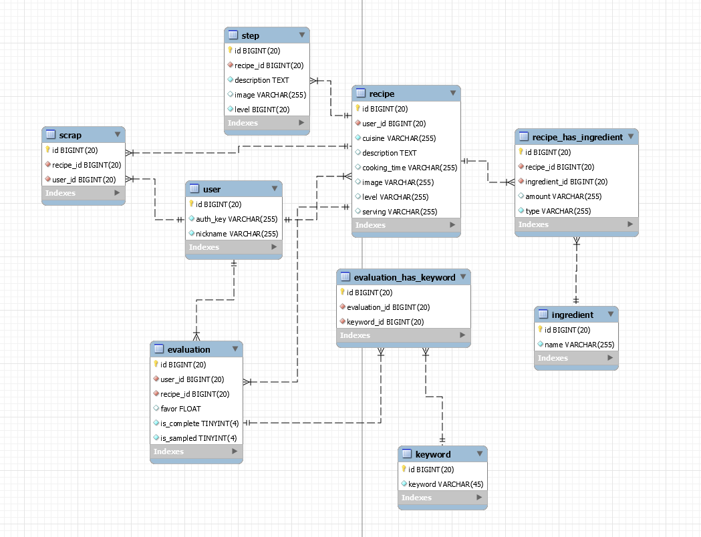
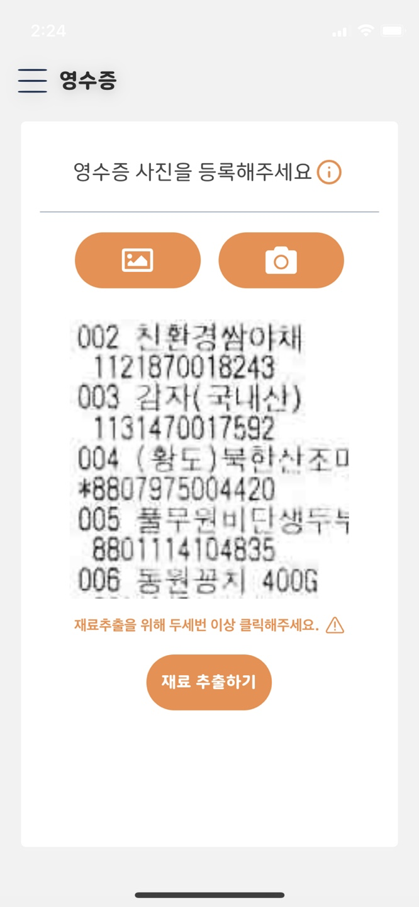

## 소개

Cooksistant는 만개의 레시피에서 자취생 데이터 960개와 협업 필터링+콘텐츠 기반 필터링을 수행하여 자취생들을 위한 레시피 추천 서비스 제공. 나랑 비슷한 평가를 한 유저들의 평가를 기반으로 추천 서비스 진행.

 

## **시스템 구조도**

## 테이블 구조도

## Cooksistant 화면

메인 화면

OCR기능

추천 화면

추천을 위한 재료 입력
